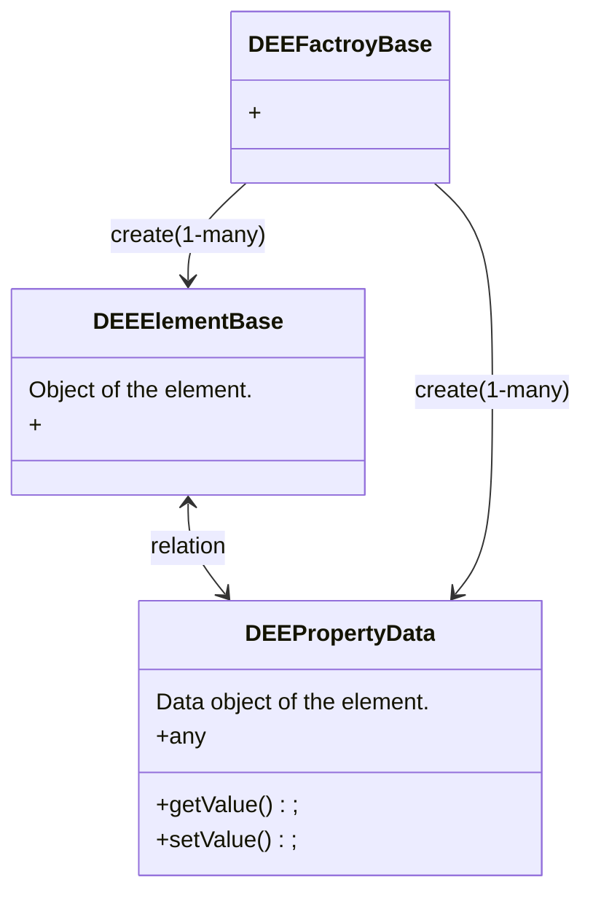

```mermaid
classDiagram
  class DEEFactroyBase {
    + 
  }

  class DEEElementBase {
    Object of the element.
    + 
  }

  class DEEPropertyData {
    Data object of the element.
    +any
    +getValue();
    +setValue();
  }

  DEEFactroyBase --> DEEElementBase : create(1-many)
  DEEElementBase <--> DEEPropertyData : relation
  DEEFactroyBase --> DEEPropertyData : create(1-many)
```

